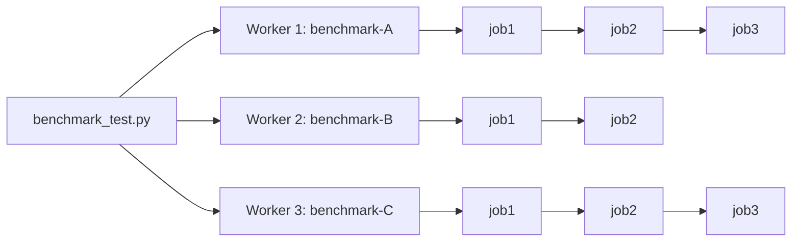
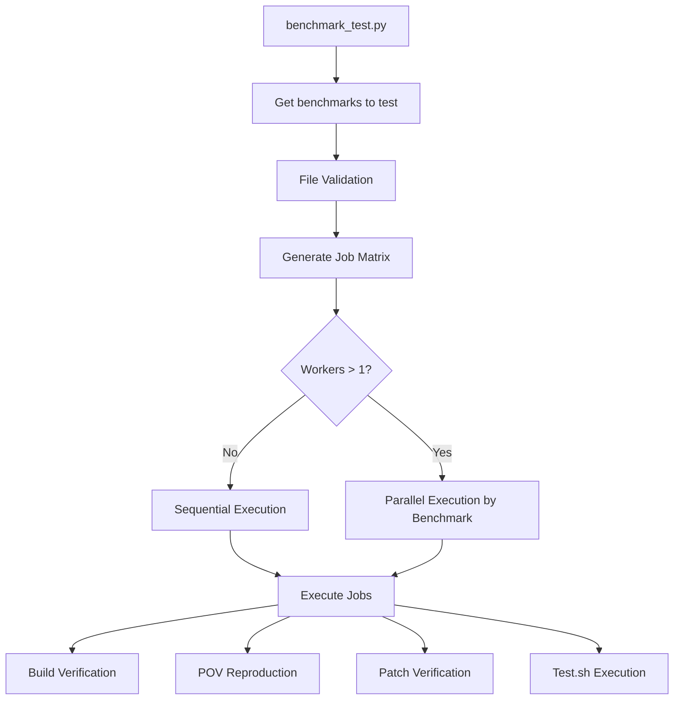
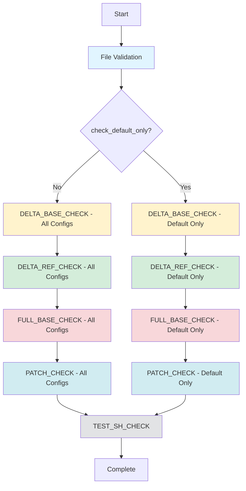

# Benchmark CI - End-to-End Testing for CRSBench Benchmarks

## Overview

Comprehensive end-to-end testing for CRSBench benchmarks to ensure they are correctly formatted and functional.

**What gets tested:**
1. **File Format**: `meta.yaml`, `project.yaml`, POV files, patches
2. **Build Verification**: Builds with different sanitizers and engines
3. **POV Reproduction**: POVs correctly trigger vulnerabilities
4. **Patch Verification**: Patches correctly fix vulnerabilities
5. **Test Execution**: `test.sh` scripts pass

---

## Quick Start

### Prerequisites

```bash
# Set PROJECT_REPOS_DIR environment variable
export PROJECT_REPOS_DIR=/path/to/repos
```

**Note**: Symlinks to `oss-fuzz/projects/` are created automatically on-demand. No manual setup required!

### Basic Usage

```bash
# Test all benchmarks
python -m crsbench.benchmark_ci.benchmark_test --run_mode all

# Test single benchmark
python -m crsbench.benchmark_ci.benchmark_test \
  --run_mode project \
  --project afc-curl-delta-02

# Test multiple specific benchmarks
python -m crsbench.benchmark_ci.benchmark_test \
  --projects afc-curl-delta-01,afc-curl-delta-02,afc-tika-delta-01

# Quick test with default sanitizer/engine only
python -m crsbench.benchmark_ci.benchmark_test --check_default_only
```

---

## Advanced Usage

### Parallel Execution

Run benchmarks in parallel (benchmark-level parallelism):

```bash
# 4 benchmarks in parallel
python -m crsbench.benchmark_ci.benchmark_test \
  --run_mode all \
  --workers 4

# Test specific benchmarks with 3 workers
python -m crsbench.benchmark_ci.benchmark_test \
  --projects curl-01,curl-02,libxml2,tika,zlib \
  --workers 3
```

**How it works:**
- Each benchmark's jobs run sequentially (maintains consistency)
- Multiple benchmarks run in parallel (improves speed)
- Docker containers provide isolation per benchmark



### Filter by Job Type

Run only specific validation stages:

```bash
# Only run test.sh checks
python -m crsbench.benchmark_ci.benchmark_test \
  --projects afc-curl-delta-01,afc-curl-delta-02 \
  --job_types test_sh_check

# Only run base commit checks and test.sh
python -m crsbench.benchmark_ci.benchmark_test \
  --projects afc-curl-delta-01 \
  --job_types delta_base_check,test_sh_check

# Only patch verification
python -m crsbench.benchmark_ci.benchmark_test \
  --projects afc-curl-delta-01 \
  --job_types patch_check
```

**Available job types:**
- `delta_base_check`: Build at base commit, verify POVs crash
- `delta_ref_check`: Build at ref commit, verify POVs don't crash
- `full_base_check`: Build at base commit (full mode)
- `patch_check`: Apply patch, verify it fixes vulnerability
- `test_sh_check`: Run test.sh script

### Combine All Options

```bash
# Specific benchmarks + specific job types + parallel execution
python -m crsbench.benchmark_ci.benchmark_test \
  --projects afc-curl-delta-01,afc-curl-delta-02,afc-libxml2-delta-01 \
  --job_types delta_base_check,test_sh_check \
  --workers 3

# Quick parallel test with default settings
python -m crsbench.benchmark_ci.benchmark_test \
  --projects curl-01,curl-02,tika-01 \
  --check_default_only \
  --workers 3
```

### Other Options

```bash
# Skip file validation (only run execution tests)
python -m crsbench.benchmark_ci.benchmark_test \
  --skip_file_check

# Skip execution tests (only validate files)
python -m crsbench.benchmark_ci.benchmark_test \
  --skip_execution_check

# Exit immediately on first error
python -m crsbench.benchmark_ci.benchmark_test \
  --exit_on_error

# Save test artifacts (logs, crash dumps) to directory
python -m crsbench.benchmark_ci.benchmark_test \
  --run_mode project \
  --project afc-curl-delta-02 \
  --output-dir /tmp/test-artifacts
```

**Artifact Storage Structure:**

When `--output-dir` is specified, test artifacts are saved in the following structure:

```
{output-dir}/
└── {benchmark}/
    └── {job_type}-{engine}-{sanitizer}/
        ├── test.sh.stdout          # test.sh stdout
        ├── test.sh.stderr          # test.sh stderr
        └── povs/
            ├── {harness}-{pov}.stdout  # POV crash logs
            └── {harness}-{pov}.stderr
```

Example:
```
/tmp/artifacts/
└── afc-curl-delta-02/
    └── delta_base_check-libfuzzer-address/
        ├── test.sh.stdout
        ├── test.sh.stderr
        └── povs/
            ├── curl_fuzzer_ws-pov_0.stdout
            └── curl_fuzzer_ws-pov_0.stderr
```

---

## Module Structure

```
crsbench/benchmark_ci/
├── __init__.py                   # Module exports
├── utils.py                      # Data structures and utilities
├── file_validator.py             # File format validation
├── run_helper.py                 # OSS-Fuzz helper.py wrapper
├── execution_validator.py        # Execution validation logic
├── benchmark_test.py             # Main orchestrator (CLI)
├── setup_benchmarks.py           # Symlink setup utility
└── README.md                     # This file
```

---

## Data Flow



---

## Job Types

Each benchmark is tested with multiple job types:

1. **`DELTA_BASE_CHECK`**: Build at base commit (clean), verify POVs do NOT crash
2. **`DELTA_REF_CHECK`**: Build at ref commit (vulnerable), verify POVs crash
3. **`FULL_BASE_CHECK`**: Build at base commit (vulnerable, full mode), verify POVs crash
4. **`PATCH_CHECK`**: Apply patch, verify it fixes vulnerability
5. **`TEST_SH_CHECK`**: Run `test.sh` to verify unit tests pass

**Note on Delta vs Full Mode:**
- In **delta mode**: `base_commit` = clean, `ref_commit` = vulnerable
- In **full mode**: `base_commit` = vulnerable (same as delta's ref_commit)

---

## Sequential Execution Pipeline

For each benchmark, jobs are executed in the following sequential order:



**Execution Details:**

1. **File Validation** (always first)
   - Validates `meta.yaml`, `project.yaml`, POV files, patches
   - Checks file format and required fields

2. **DELTA_BASE_CHECK** (clean state, delta mode only)
   - Build at base commit (clean version before bug-inducing diff)
   - Verify POVs do NOT crash (no vulnerability yet)
   - Tests all configs or default only based on `--check_default_only`

3. **DELTA_REF_CHECK** (vulnerable state, delta mode only)
   - Build at ref commit (vulnerable version after bug-inducing diff)
   - Verify POVs crash (vulnerability present)
   - Unit tests should still pass despite vulnerability

4. **FULL_BASE_CHECK** (vulnerable state, full mode only)
   - Build at base commit in full mode (vulnerable version)
   - Verify POVs crash
   - Note: In full mode, base_commit is same as delta mode's ref_commit

5. **PATCH_CHECK** (patch verification)
   - Apply patch to vulnerable commit
   - Build and verify POVs don't crash
   - Confirms patch fixes vulnerability
   - Patch is reverted after verification

6. **TEST_SH_CHECK** (unit tests)
   - Run `test.sh` script
   - Verify project-specific tests pass

**Delta vs Full Mode:**
- **Delta mode**: Provides both clean (base) and vulnerable (ref) commits
  - `base_commit` → apply bug-inducing diff → `ref_commit`
  - Tests verify the diff actually introduces the vulnerability
- **Full mode**: Provides only vulnerable commit
  - `base_commit` = vulnerable version
  - No clean state to compare against

**Job Filtering:**

Use `--job_types` to run specific stages only:

```bash
# Run only base and ref checks
python -m crsbench.benchmark_ci.benchmark_test \
  --projects afc-curl-delta-01 \
  --job_types delta_base_check,delta_ref_check

# Skip to patch verification
python -m crsbench.benchmark_ci.benchmark_test \
  --projects afc-curl-delta-01 \
  --job_types patch_check,test_sh_check
```

---

## Source Code Management

The benchmark CI uses `crsbench.migration.repo_manager` to manage source code:

1. **Environment Variable**: `PROJECT_REPOS_DIR` specifies where git repos are cloned
   - Default: `/home/acorn421/work/team-atlanta/afc-repos`
   - Override: `export PROJECT_REPOS_DIR=/your/path`

2. **Auto-cloning**: `ensure_project_repository()` automatically:
   - Checks if repo already exists in `PROJECT_REPOS_DIR`
   - Clones from `project.yaml`'s `main_repo` if needed
   - Checks out commit from `meta.yaml` (base_commit)

3. **Repository Naming**:
   - By default, derives directory name from repo URL
   - Supports explicit `repo_name` field in `project.yaml`:
     ```yaml
     main_repo: "git@github.com:Team-Atlanta/official-afc-curl.git"
     repo_name: "cp-c-curl"  # Explicit directory name
     ```

---

## CI Integration

```bash
# Run all tests
python -m crsbench.benchmark_ci.benchmark_test --run_mode all

# Exit on first error (faster feedback)
python -m crsbench.benchmark_ci.benchmark_test \
  --run_mode all \
  --exit_on_error

# Parallel execution in CI
python -m crsbench.benchmark_ci.benchmark_test \
  --run_mode all \
  --workers 8 \
  --check_default_only
```